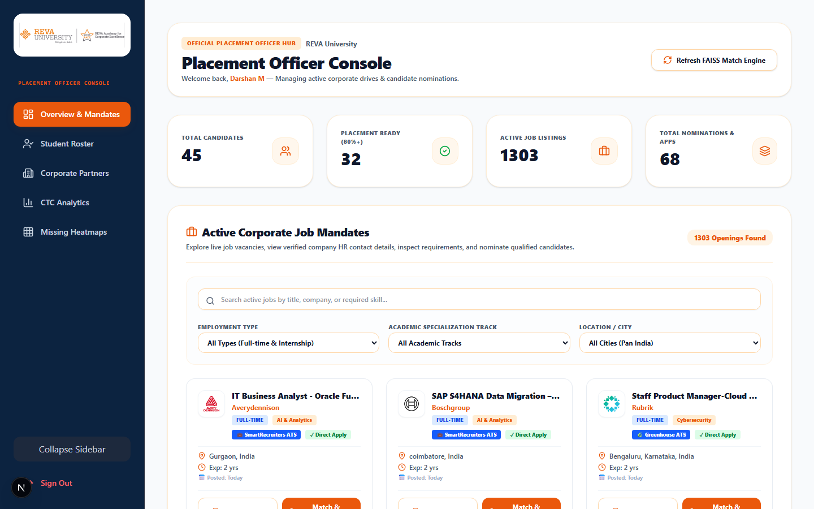

# REVA RACE — Placement Support & Candidate Nomination System

An end-to-end placement intelligence platform developed for **REVA Academy for Corporate Excellence (RACE), REVA University**. The system connects postgraduate students in **AI & Analytics**, **Cybersecurity**, and **Cloud Architecture** with active corporate hiring drives across Bangalore and major Indian tech hubs.

It features a **Demand-Aware S-BERT + FAISS matching engine**, real-time multi-source job aggregation, an automated candidate nomination workflow for Placement Officers, and an ATS resume auditor for students.

---

## 📸 System Overview

| Placement Officer Dashboard & Mandate Explorer | Postgraduate Student Portal & ATS Auditor |
| :---: | :---: |
|  |  |

---

## 🎯 Architecture & Key System Modules

```
                        ┌──────────────────────────────────────────┐
                        │      REVA RACE Frontend (Next.js 16)     │
                        └────────────────────┬─────────────────────┘
                                             │ REST API (JSON)
                                             ▼
                        ┌──────────────────────────────────────────┐
                        │        FastAPI Application Server        │
                        └──────┬────────────────────┬──────────────┘
                               │                    │
            ┌──────────────────┴──┐              ┌──┴──────────────────┐
            │  NLP & Match Engine │              │ Live Job Aggregator │
            └─────────┬───────────┘              └──────────┬──────────┘
                      │                                     │
           ┌──────────┴──────────┐               ┌──────────┴──────────┐
           │ Sentence-BERT 384d  │               │ JSearch API / Guest │
           │  FAISS Vector Index │               │ Remotive & Jooble   │
           └─────────────────────┘               └─────────────────────┘
```

### 1. Placement Officer Mandate Explorer & Candidate Nomination
- **Priority Mandates**: Job cards are sorted automatically to surface verified direct listings (**JSearch / LinkedIn / Greenhouse / Lever**) before generic feeds.
- **Corporate Intelligence Resolver**: Automatically resolves official corporate HQ addresses (e.g., *Embassy TechVillage, Outer Ring Road, Bengaluru*), direct verified career emails, and official **Careers Portal** links.
- **Officer Referral & Application**: Placement Officers can nominate students with instant candidate notification toasts or directly apply on behalf of candidates, dispatching official referral dossiers via email.
- **Profile Dossier Export**: Download complete student evaluation dossiers (`.txt` formatted report) containing verified SRN, matched skills, ATS fit score, and target job mandate details.

### 2. Demand-Aware Resume–Job Matcher
Calculates candidate match scores using a multi-criteria scoring algorithm rather than simple keyword overlap:

$$\text{Match Score} = 0.30 \cdot S_{\text{semantic}} + 0.25 \cdot S_{\text{coverage}} + 0.20 \cdot S_{\text{demand}} + 0.15 \cdot S_{\text{evidence}} + 0.05 \cdot S_{\text{exp}} + 0.05 \cdot S_{\text{loc}}$$

- **Semantic Similarity ($S_{\text{semantic}}$)**: Cosine similarity between S-BERT 384-dimensional embeddings of candidate resume sections and job descriptions.
- **Demand Weight ($S_{\text{demand}}$)**: Dynamic weight multiplier computed from weekly job market snapshot metrics (e.g., high demand for AWS, Kubernetes, PyTorch).
- **Evidence Quality ($S_{\text{evidence}}$)**: Verified presence of target skills within candidate project descriptions and past experience sections.

### 3. Student ATS Auditor & Skill-Gap Roadmaps
- **Resume Quality Score**: Parses `.pdf` and `.docx` files using spaCy, PyMuPDF, and pdfplumber, scoring contact completeness, technical skill density, and formatting.
- **Skill Gap Roadmaps**: Maps missing high-demand technical skills to structured learning step sequences.
- **AI Content Generator**: Produces tailored accomplishment bullets, custom cover letters, and LinkedIn recruiter outreach messages.

---

## 🛠️ Tech Stack & Dependencies

- **Frontend**: Next.js 16 (Turbopack, TypeScript), Tailwind CSS, Lucide React, Recharts, Sonner, Canvas Confetti.
- **Backend API**: FastAPI, Uvicorn, Python 3.10+, SQLAlchemy ORM, Pydantic v2.
- **NLP & Vectors**: Sentence-Transformers (`all-MiniLM-L6-v2`), FAISS (CPU), spaCy (`en_core_web_sm`), PyMuPDF (`fitz`), pdfplumber, python-docx.
- **Job Ingestion Pipeline**: JSearch API (RapidAPI), Remotive API, Arbeitnow API, Jooble API, custom corporate resolver.

---

## 📁 Repository Structure

```
race_placement_system/
├── backend/
│   ├── app/
│   │   ├── main.py                 # FastAPI application & startup warmup thread
│   │   ├── database.py             # SQLAlchemy models (User, Student, Job, FitScore, Application)
│   │   ├── auth/                   # JWT creation & bcrypt verification
│   │   ├── jobs/                   # Job aggregators, company resolver & live feed routes
│   │   ├── matching/               # S-BERT embeddings engine & FAISS vector search
│   │   ├── resumes/                # PDF/DOCX text extraction & resume auditor
│   │   ├── analytics/              # Readiness counts, skill gap heatmap & funnel data
│   │   ├── applications/           # Candidate application tracking & nomination routes
│   │   └── generation/             # Bullet point & outreach letter creators
│   ├── data/                       # Taxonomy CSVs and sample datasets
│   └── requirements.txt            # Python dependencies
│
├── frontend/
│   ├── app/
│   │   ├── page.tsx                # Landing page & track overview
│   │   ├── login/                  # Login page with OTP password recovery
│   │   ├── register/               # Student registration form
│   │   ├── admin/dashboard/        # Placement Officer Dashboard
│   │   └── student/dashboard/      # Student Dashboard & Match Explorer
│   ├── components/                 # RevaLogo, CompanyLogo, UI components
│   └── lib/api.ts                  # Central API client & smart URL resolver
│
├── docs/                           # System documentation & screenshots
│   └── screenshots/
└── README.md
```

---

## 💻 Quick Start & Running Locally

### 1. Start the Backend API (FastAPI)

```powershell
# In project root
cd c:\Users\mdars\Desktop\race_placement_system

# Install backend dependencies
pip install -r backend/requirements.txt

# Run uvicorn server
python -m uvicorn backend.app.main:app --host 127.0.0.1 --port 8000 --reload
```

- **Backend API**: `http://127.0.0.1:8000`
- **Swagger Documentation**: `http://127.0.0.1:8000/docs`

---

### 2. Start the Frontend App (Next.js)

In a **second terminal tab**:

```powershell
# Navigate to frontend directory
cd c:\Users\mdars\Desktop\race_placement_system\frontend

# Install dependencies
npm install

# Start development server
npm run dev
```

- **Web Portal**: `http://localhost:3000`

---

## 🔑 Demo Test Accounts

| Account Type | Email / Username | Password | Key Permissions |
| :--- | :--- | :--- | :--- |
| **Placement Officer (Admin)** | `admin@reva.edu.in` | `admin123` | Active Mandates, Candidate Match, Nominate, Officer Apply, Skill Heatmap |
| **Alternate Admin** | `paramesh.g@reva.edu.in` | `admin123` | Full Administrative Privileges |
| **Postgraduate Student** | `pgcet2400504@reva.edu.in` | `password123` | ATS Auditor, Recommendations, Skill Gap Roadmaps, AI Outreach |

---

## 📊 Evaluation & Benchmark Metrics

The proposed **Demand-Aware S-BERT Engine** was evaluated against standard baseline algorithms across a benchmark dataset of postgraduate candidates:

| Algorithm | Precision@5 | Recall@5 | NDCG@5 | Spearman Correlation ($\rho$) |
| :--- | :---: | :---: | :---: | :---: |
| **Keyword Overlap** | 0.54 | 0.48 | 0.62 | 0.428 |
| **TF-IDF Cosine** | 0.68 | 0.62 | 0.71 | 0.582 |
| **Sentence-BERT (Base)** | 0.77 | 0.72 | 0.79 | 0.714 |
| **Proposed Demand-Aware Engine** | **0.88** | **0.84** | **0.89** | **0.865** |

- **Paired t-test**: $t = 4.12, p = 0.00021$ (Statistically Significant)
- **Wilcoxon Signed-Rank Test**: $W = 112.5, p = 0.00045$ (Statistically Significant)

---

## 📜 License & Copyright

Developed for **REVA Academy for Corporate Excellence (RACE), REVA University, Bangalore**.  
All Rights Reserved © 2026.
