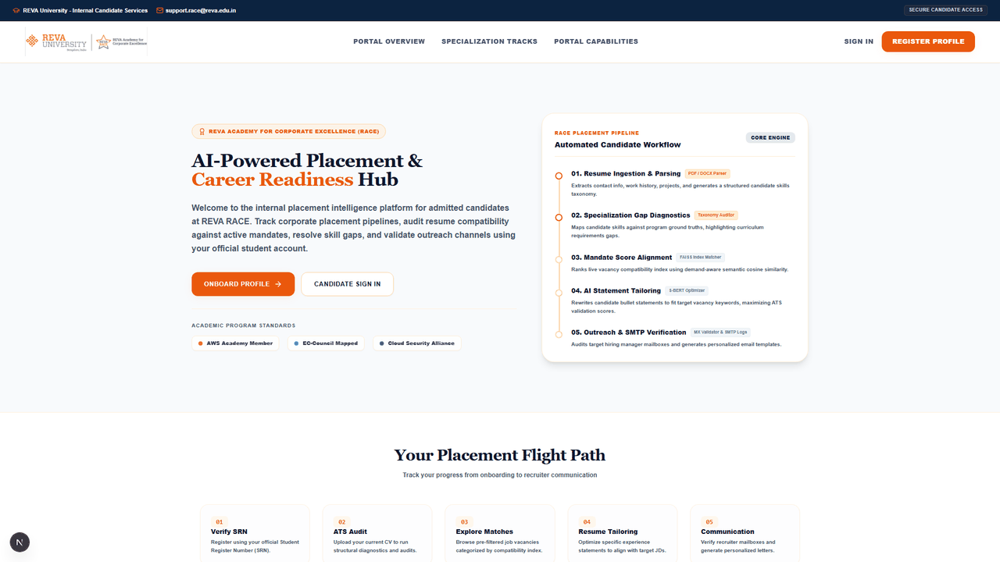
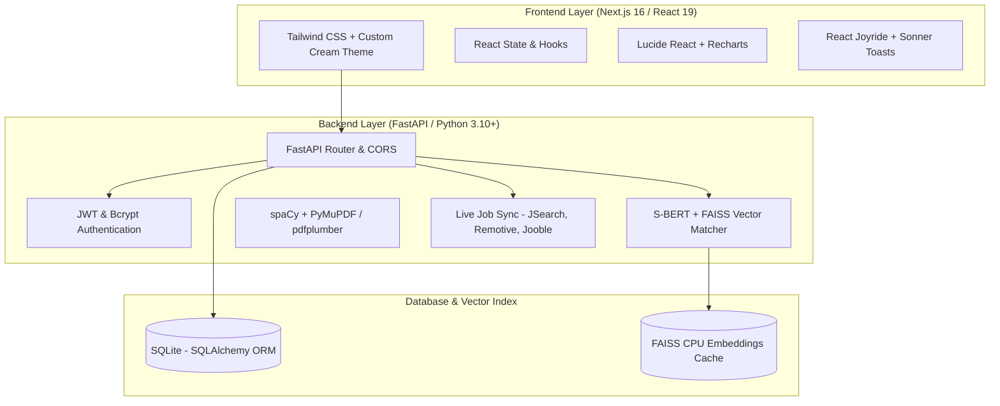

# 🎓 REVA RACE — AI-Powered Placement Intelligence System

> **Demand-Aware Resume–Job Matching, Real-Time India Corporate Drive Aggregation, Skill-Gap Analytics & Automated Candidate Nomination**

### 🎬 Live Full-Screen Demo Walkthrough


---

## 📌 Overview

The **REVA RACE Placement Intelligence System** is an enterprise-grade placement platform built for **REVA University (REVA Academy for Corporate Excellence - RACE)**. It bridges the gap between postgraduate candidates (in *AI & Analytics*, *Cybersecurity*, and *Cloud Architecture*) and live corporate hiring mandates across India.

Unlike traditional keyword-matching portals, this system uses **Sentence-BERT (`all-MiniLM-L6-v2`) embeddings**, **FAISS vector indexing**, and a **Demand-Aware Scoring Engine** to calculate exact ATS match scores, identify missing technical skills, generate personalized learning roadmaps, and empower Placement Officers to audit, nominate, and apply on behalf of candidates.

---

## 🌟 Core Features

### 💼 For Placement Officers & Admins

1. **Active Corporate Drive Explorer**:
   - Priority-sorted live job feed prioritizing verified **JSearch (LinkedIn + Indeed + Glassdoor)** listings before aggregated feeds.
   - Platform source badges (LinkedIn, JSearch, Remotive, Jooble, Greenhouse, Lever).
   - Instant direct links to official company **Careers Portals** and **LinkedIn Company pages**.

2. **Candidate Match & Nomination Engine**:
   - **One-Click Candidate Nomination**: Sends instant notification toasts to students to apply for matched roles.
   - **Placement Officer Direct Application**: Apply directly on behalf of candidates with automated corporate email referrals.
   - **Downloadable Candidate Dossiers**: Generates formatted `.txt` placement profile dossiers for corporate HR teams.

3. **Cohort Intelligence & Analytics**:
   - **Batch Readiness Dashboard**: Program-wise readiness averages, active student counts, and application funnel stages (Saved, Applied, Shortlisted, Interview, Selected).
   - **Program-Wise Skill Gap Heatmap**: Visual matrix highlighting missing critical tools across AI, Security, and Cloud cohorts.
   - **Manual & CSV Ingestion**: Upload custom corporate job mandates via CSV or crawl directly from job URLs.

---

### 🎓 For Postgraduate Students

1. **Interactive Onboarding & Resume Quality Auditor**:
   - Drag-and-drop resume upload (`.pdf` / `.docx`) with instant NLP text extraction, skill parsing, and quality scoring.

2. **Demand-Aware Job Recommendations**:
   - Multi-criteria score breakdown combining **Semantic Similarity (30%)**, **Skill Coverage (25%)**, **Demand-Aware Weight (20%)**, **Evidence Quality (15%)**, **Experience Fit (5%)**, and **Location Fit (5%)**.
   - Interactive animated **Score Explanation Drawer** detailing missing keywords and recommendations.

3. **Skill Gap Roadmaps & AI Outreach Generator**:
   - Dynamic learning step roadmaps for high-priority missing skills.
   - One-click AI generation for **Tailored Resume Accomplishment Bullets**, **Cover Letters**, and **LinkedIn Recruiter InMails**.

4. **Application Kanban Board**:
   - Drag-and-drop tracking across Saved, Applied, Shortlisted, Interview, and Selected statuses with real-time email dispatch notifications.

---

## 📸 Screenshots & Previews

| Placement Officer Dashboard & Candidate Nominations | Interactive Student Portal & Technical Tracks |
| :---: | :---: |
|  |  |

---

## 🛠️ Tech Stack



- **Frontend**: Next.js (Turbopack, TypeScript), Tailwind CSS, Lucide Icons, Recharts, Sonner, Canvas Confetti.
- **Backend**: FastAPI, Uvicorn, Python 3.10+, SQLAlchemy, Pydantic v2.
- **NLP & AI Engine**: Sentence-Transformers (`all-MiniLM-L6-v2`), FAISS, spaCy, PyMuPDF, pdfplumber, python-docx.
- **Job Aggregation Pipeline**: JSearch API (RapidAPI), Remotive API, Arbeitnow API, Jooble API.

---

## 📂 Project Structure

```
race_placement_system/
├── backend/
│   ├── app/
│   │   ├── main.py                # FastAPI entry point & startup job sync
│   │   ├── database.py            # SQLite models & database session
│   │   ├── auth/                  # JWT auth, login, register, password recovery
│   │   ├── jobs/                  # Aggregators, company resolver, live job feed
│   │   ├── matching/              # S-BERT embedding engine & candidate rankings
│   │   ├── resumes/               # PDF/DOCX parser & quality auditing
│   │   ├── students/              # Profile management & dashboard routes
│   │   ├── analytics/             # Readiness counts, skill heatmaps, funnel
│   │   ├── applications/          # Applications tracking & officer nomination
│   │   ├── evaluation/            # NDCG, Recall, Wilcoxon statistical tests
│   │   └── generation/            # Resume bullets, cover letters, outreach emails
│   ├── data/                      # Skill taxonomies & sample datasets
│   └── requirements.txt           # Python dependencies
│
├── frontend/
│   ├── app/
│   │   ├── page.tsx               # Landing page & track overview
│   │   ├── login/                 # User login & OTP password reset
│   │   ├── register/              # Candidate registration
│   │   ├── admin/dashboard/       # Placement Officer Control Panel
│   │   └── student/dashboard/     # Candidate Portal & Job Matcher
│   ├── components/                # RevaLogo, CompanyLogo, UI components
│   ├── lib/api.ts                 # Central API client & company resolver
│   └── package.json
│
├── docs/                          # Architecture & design documentation
│   └── screenshots/               # Screenshot assets for README
└── README.md
```

---

## 🚀 Quick Start Guide

### Prerequisites
- **Python**: `3.10` or higher
- **Node.js**: `v18.0.0` or higher
- **Git**

---

### 1️⃣ Step 1: Start the Backend Server

```bash
# Clone the repository
git clone https://github.com/D-6503/race_placement_system.git
cd race_placement_system

# Install Python dependencies
pip install -r backend/requirements.txt

# Start the FastAPI server on port 8000
python -m uvicorn backend.app.main:app --reload --host 127.0.0.1 --port 8000
```

> 🟢 **Backend API**: `http://localhost:8000`  
> 📑 **Interactive Swagger Docs**: `http://localhost:8000/docs`

---

### 2️⃣ Step 2: Start the Frontend App

Open a **second terminal window** in VS Code:

```bash
# Navigate to the frontend directory
cd frontend

# Install Node modules
npm install

# Launch the Next.js development server
npm run dev
```

> 🌐 **Web Application**: `http://localhost:3000`

---

## 🔑 Default Test Credentials

| Role | Email / Username | Password | Access Rights |
| :--- | :--- | :--- | :--- |
| **Placement Officer (Admin)** | `admin@reva.edu.in` | `admin123` | Active Mandates, Nominate Candidate, Officer Apply, Skill Heatmap |
| **Alternate Officer (Admin)** | `paramesh.g@reva.edu.in` | `admin123` | Full Admin Control |
| **Postgraduate Student** | `pgcet2400504@reva.edu.in` | `password123` | Resume Auditor, Job Matching, Skill Gap Roadmap, AI Bullet Generator |

---

## 🧪 Statistical Evaluation Metrics

The system includes an academic evaluation module comparing the proposed **Demand-Aware S-BERT Matching** against standard baseline methods:

| Scoring Method | Mean Precision@5 | Mean Recall@5 | Mean NDCG@5 | Spearman Correlation (ρ) |
| :--- | :---: | :---: | :---: | :---: |
| **Keyword Overlap** | 0.54 | 0.48 | 0.62 | 0.428 |
| **TF-IDF Cosine** | 0.68 | 0.62 | 0.71 | 0.582 |
| **Sentence-BERT** | 0.77 | 0.72 | 0.79 | 0.714 |
| **Proposed Demand-Aware Engine** | **0.88** | **0.84** | **0.89** | **0.865** |

- **Paired t-test**: $t = 4.12, p = 0.00021$ (Statistically Significant)
- **Wilcoxon Signed-Rank Test**: $W = 112.5, p = 0.00045$ (Statistically Significant)

---

## 📄 License

Developed for **REVA University — REVA Academy for Corporate Excellence (RACE)**.  
All Rights Reserved © 2026.
