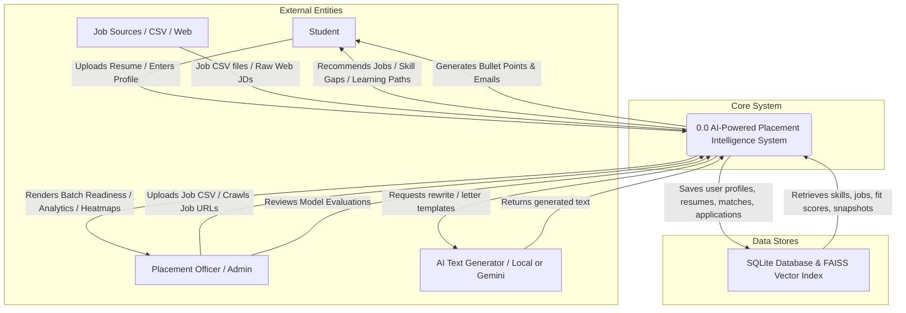

# Data Flow Diagram (DFD) - Level 0

This document displays the Level 0 Data Flow Diagram for the system, showing the boundary between external entities and the core system process.

```mermaid
graph TD
    %% External Entities
    subgraph External Entities
        Student[Student]
        PO[Placement Officer / Admin]
        JS[Job Sources / CSV / Web]
        AI[AI Text Generator / Local or Gemini]
    end

    %% Core Process
    subgraph Core System
        System("0.0 AI-Powered Placement Intelligence System")
    end

    %% Data Stores
    subgraph Data Stores
        DB[SQLite Database & FAISS Vector Index]
    end

    %% Student Data Flows
    Student -->|"Uploads Resume / Enters Profile"| System
    System -->|"Recommends Jobs / Skill Gaps / Learning Paths"| Student
    System -->|"Generates Bullet Points & Emails"| Student

    %% Admin Data Flows
    PO -->|"Uploads Job CSV / Crawls Job URLs"| System
    System -->|"Renders Batch Readiness / Analytics / Heatmaps"| PO
    PO -->|"Reviews Model Evaluations"| System

    %% Job Sources Data Flows
    JS -->|"Job CSV files / Raw Web JDs"| System

    %% AI Generator Data Flows
    System -->|"Requests rewrite / letter templates"| AI
    AI -->|"Returns generated text"| System

    %% Database Flows
    System -->|"Saves user profiles, resumes, matches, applications"| DB
    DB -->|"Retrieves skills, jobs, fit scores, snapshots"| System
```
