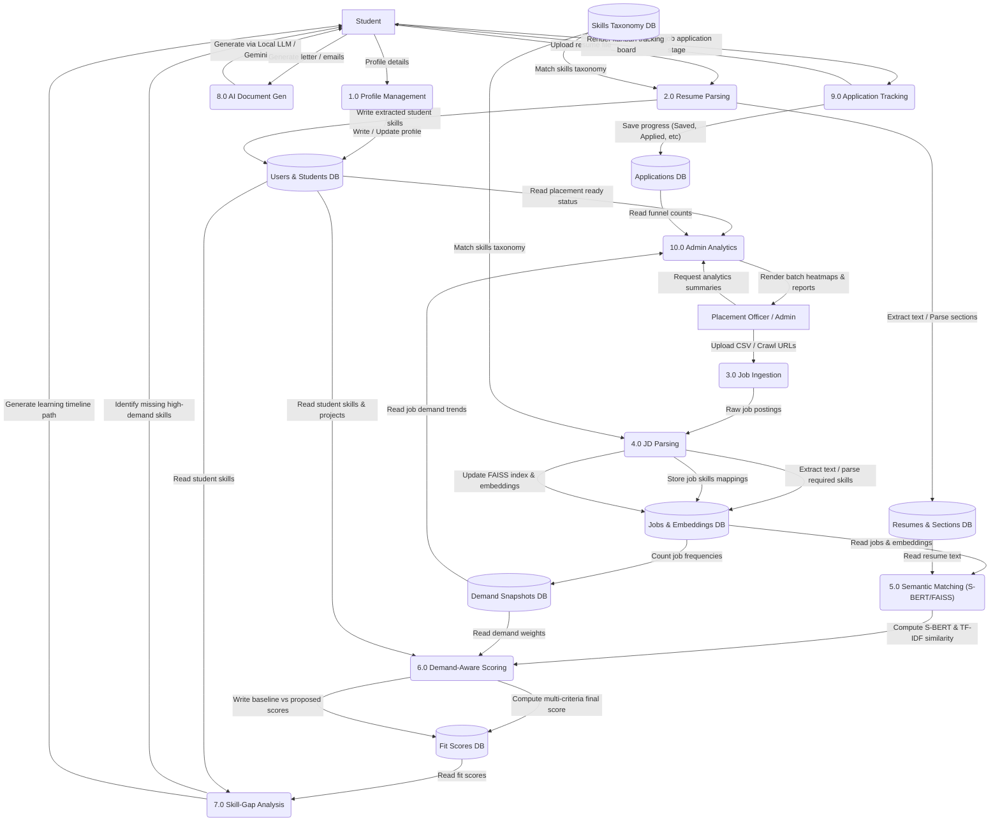

# Data Flow Diagram (DFD) - Level 1

This document decomposes the system into its core sub-processes, tracking how data flows from ingestion to scoring, analytics, and outreach support.

```mermaid
graph TD
    %% Entities
    Student[Student]
    PO[Placement Officer / Admin]

    %% Processes
    P1("1.0 Profile Management")
    P2("2.0 Resume Parsing")
    P3("3.0 Job Ingestion")
    P4("4.0 JD Parsing")
    P5("5.0 Semantic Matching (S-BERT/FAISS)")
    P6("6.0 Demand-Aware Scoring")
    P7("7.0 Skill-Gap Analysis")
    P8("8.0 AI Document Gen")
    P9("9.0 Application Tracking")
    P10("10.0 Admin Analytics")

    %% Data Stores
    D1[(Users & Students DB)]
    D2[(Resumes & Sections DB)]
    D3[(Jobs & Embeddings DB)]
    D4[(Skills Taxonomy DB)]
    D5[(Fit Scores DB)]
    D6[(Applications DB)]
    D7[(Demand Snapshots DB)]

    %% Flow lines
    Student -->|"Profile details"| P1
    P1 -->|"Write / Update profile"| D1

    Student -->|"Upload resume file"| P2
    P2 -->|"Extract text / Parse sections"| D2
    D4 -->|"Match skills taxonomy"| P2
    P2 -->|"Write extracted student skills"| D1

    PO -->|"Upload CSV / Crawl URLs"| P3
    P3 -->|"Raw job postings"| P4
    P4 -->|"Extract text / parse required skills"| D3
    D4 -->|"Match skills taxonomy"| P4
    P4 -->|"Store job skills mappings"| D3
    P4 -->|"Update FAISS index & embeddings"| D3

    D3 -->|"Read jobs & embeddings"| P5
    D2 -->|"Read resume text"| P5
    P5 -->|"Compute S-BERT & TF-IDF similarity"| P6

    D3 -->|"Count job frequencies"| D7
    D7 -->|"Read demand weights"| P6
    D1 -->|"Read student skills & projects"| P6
    P6 -->|"Compute multi-criteria final score"| D5
    P6 -->|"Write baseline vs proposed scores"| D5

    D5 -->|"Read fit scores"| P7
    D1 -->|"Read student skills"| P7
    P7 -->|"Identify missing high-demand skills"| Student
    P7 -->|"Generate learning timeline path"| Student

    Student -->|"Generate letter / emails"| P8
    P8 -->|"Generate via Local LLM / Gemini"| Student

    Student -->|"Update job application stage"| P9
    P9 -->|"Save progress (Saved, Applied, etc)"| D6
    P9 -->|"Render kanban tracking board"| Student

    PO -->|"Request analytics summaries"| P10
    D1 -->|"Read placement ready status"| P10
    D6 -->|"Read funnel counts"| P10
    D7 -->|"Read job demand trends"| P10
    P10 -->|"Render batch heatmaps & reports"| PO
```
